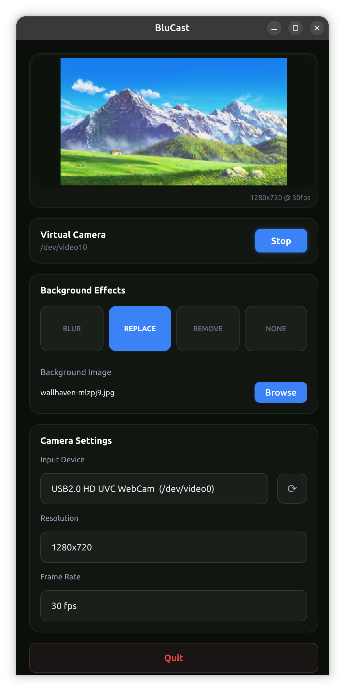

<div align="center">


 <h1 align="center">BluCast</h1>

<p align="center">
  Real-time AI-powered video effects using NVIDIA Maxine VideoFX SDK.<br>
  Basically NVIDIA Broadcast, but for Linux.
</p>

</div>

<p align="center">
  
</p>


<!-- omit from toc -->
## Table of Contents
- [Features](#features)
- [Prerequisites](#prerequisites)
- [Quick Start](#quick-start)
- [Usage](#usage)
- [Configuration](#configuration)
- [Building from Source](#building-from-source)
  - [1. Clone the repository](#1-clone-the-repository)
  - [2. Download the NVIDIA Maxine SDK, if you have an AI Enterprise subscription :(](#2-download-the-nvidia-maxine-sdk-if-you-have-an-ai-enterprise-subscription-)
  - [3. Extract SDKs to the `sdk/` directory](#3-extract-sdks-to-the-sdk-directory)
  - [4. Build and run](#4-build-and-run)
- [Virtual Camera Setup](#virtual-camera-setup)
- [Troubleshooting](#troubleshooting)
  - [No camera detected](#no-camera-detected)
  - [GPU errors](#gpu-errors)
- [License](#license)
  - [Third-Party Components](#third-party-components)
- [Contributing](#contributing)
- [Acknowledgments](#acknowledgments)


## Features

- **Background Removal**
- **Background Replacement** - Use any image as your background
- **Background Blur**
- **On-demand camera usage** - Camera (and processing power) is only used when needed

## Prerequisites

The following must be installed on your host system **before** installing BluCast:

- **NVIDIA GPU**
- **NVIDIA drivers** with CUDA support - verify with `nvidia-smi`
- **Podman or Docker**
- **[NVIDIA Container Toolkit](https://docs.nvidia.com/datacenter/cloud-native/container-toolkit/install-guide.html)** - required for GPU passthrough into the container
  - Fedora: `sudo dnf install nvidia-container-toolkit`
  - Ubuntu: follow the [official install guide](https://docs.nvidia.com/datacenter/cloud-native/container-toolkit/install-guide.html)
- **[v4l2loopback](https://github.com/umlaeute/v4l2loopback)** - kernel module for the virtual camera device
  - Fedora: `sudo dnf install v4l2loopback`
  - Ubuntu: `sudo apt install v4l2loopback-dkms`
- **(if you're using GNOME):** [AppIndicator extension](https://extensions.gnome.org/extension/615/appindicator-support/) - required for the system tray icon
  - Without this extension, the system tray icon will not appear and closing the window will not minimize to tray

## Quick Start

The easiest way to get BluCast running:

```bash
curl -fsSL https://raw.githubusercontent.com/Andrei9383/BluCast/main/scripts/install-remote.sh | bash
```

Or manually:

```bash
# Pull the container
podman pull ghcr.io/andrei9383/blucast:latest

# Setup virtual camera (requires v4l2loopback)
sudo modprobe v4l2loopback devices=1 video_nr=10 card_label="BluCast Camera" exclusive_caps=1

# Run
podman run --rm \
  --device nvidia.com/gpu=all \
  --device /dev/video0 \
  --device /dev/video10 \
  -e DISPLAY=$DISPLAY \
  -v /tmp/.X11-unix:/tmp/.X11-unix \
  -v $HOME/.config/blucast:/root/.config/blucast \
  --network host \
  ghcr.io/andrei9383/blucast:latest
```

After installation, run `blucast` from terminal or find it in your application menu.

## Usage

1. Launch Blucast by running the desktop entry application or by running `./run.sh` at the install location
2. Select your desired effect from the dropdown
3. For custom backgrounds, click "Browse" and select an image
4. The virtual camera appears as `/dev/video10`
5. Select "BluCast Camera" in your video conferencing app

## Configuration

Settings are stored in `~/.config/blucast/settings.json` and persist between sessions.

The configuration file looks like this:
```json
{
  "effect_mode"     : "",      // "blur" | "replace" | "remove" | "none"
  "background_image": "",      // path to image
  "blur_strength"   : 0,       // 0-100
  "vcam_enabled"    : False,   // True | False
  "preview_enabled" : False,   // True | False
  "overlay_enabled" : False,   // True | False
  "resolution"      : "",      // resolution, eg "1280x720"
  "fps"             : 30,
  "input_device"    : "",      // device path, eg "/dev/video0"
}
```

## Building from Source

If you prefer to build locally (if you have the SDK available):

> [!NOTE]
> The Maxine SDK (for version v0.7.2.0), as per my trials, requires (very) specific versions of cuDNN and TensorRT:
> - CUDA 11.8.0
> - cuDNN 8.6.0.163
> - TensorRT 8.5.1.7

### 1. Clone the repository

```bash
git clone https://github.com/Andrei9383/BluCast.git
cd BluCast
```

### 2. Download the NVIDIA Maxine SDK, if you have an AI Enterprise subscription :(

1. Visit [NVIDIA Catalog](https://catalog.ngc.nvidia.com/)
3. Download the **Video Effects SDK** for Linux
4. Download **TensorRT 8.5.x** and **cuDNN 8.x** (check the versions specified in the documentation of the SDK, usually they are pretty strict)

### 3. Extract SDKs to the `sdk/` directory

```bash
mkdir -p sdk
# Extract VideoFX SDK
tar -xzf Video_Effects_SDK_*.tar.gz -C sdk/
mv sdk/Video_Effects_SDK* sdk/VideoFX

# Extract TensorRT
tar -xzf TensorRT-8.5.*.tar.gz -C sdk/

# Extract cuDNN (copy libraries)
mkdir -p sdk/cudnn
tar -xzf cudnn-*.tar.xz
cp -r cudnn-*/lib/* sdk/cudnn/
cp -r cudnn-*/include/* sdk/cudnn/
```

Your `sdk/` directory should look like:
```
sdk/
├── VideoFX/
├── TensorRT-8.5.1.7/
└── cudnn/
```

### 4. Build and run

```bash
./install.sh
./run.sh
```


## Virtual Camera Setup

BluCast uses v4l2loopback to create a virtual camera. The installer handles this automatically, but if needed:

```bash
sudo modprobe v4l2loopback devices=1 video_nr=10 card_label="BluCast Camera" exclusive_caps=1
```

To load automatically on boot, create `/etc/modules-load.d/v4l2loopback.conf`:
```
v4l2loopback
```

And `/etc/modprobe.d/v4l2loopback.conf`:
```
options v4l2loopback devices=1 video_nr=10 card_label="BluCast Camera" exclusive_caps=1
```

## Troubleshooting

### No camera detected
- Ensure your webcam is connected: `ls /dev/video*`
- Check camera permissions: `groups | grep video`

### GPU errors
- Verify NVIDIA drivers: `nvidia-smi`
- Check Container Toolkit: `podman run --rm --device nvidia.com/gpu=all nvidia/cuda:11.8.0-base-ubuntu20.04 nvidia-smi`

### Error setting up CDI
- If you encounter an error such as: `Error: setting up CDI devices: unresolvable CDI devices nvidia.com/gpu=all`, that means the CDI spec hasn't been generated (yet). Try running:
`sudo nvidia-ctk cdi generate --output=/etc/cdi/nvidia.yaml`


## License

This project is licensed under the MIT License - see [LICENSE](LICENSE) for details.

### Third-Party Components

- **NVIDIA Maxine SDK**
- **OpenCV**
- **PySide6**
- **TensorRT**

## Contributing

Contributions are welcome! Please read [CONTRIBUTING.md](CONTRIBUTING.md) for guidelines.

## Acknowledgments

- NVIDIA Maxine team for the VideoFX SDK
- OpenCV community
- Qt/PySide6 project
